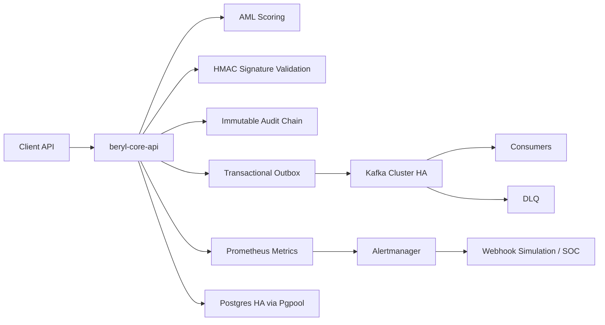

# Diagramme flux financier

```mermaid
flowchart LR
    A[Client API] --> B[beryl-core-api]
    B --> C[AML Scoring]
    B --> D[HMAC Signature Validation]
    B --> E[Immutable Audit Chain]
    B --> F[Transactional Outbox]
    F --> G[Kafka Cluster HA]
    G --> H[Consumers]
    G --> I[DLQ]
    B --> J[Prometheus Metrics]
    J --> K[Alertmanager]
    K --> L[Webhook Simulation / SOC]
    B --> M[Postgres HA via Pgpool]
```
